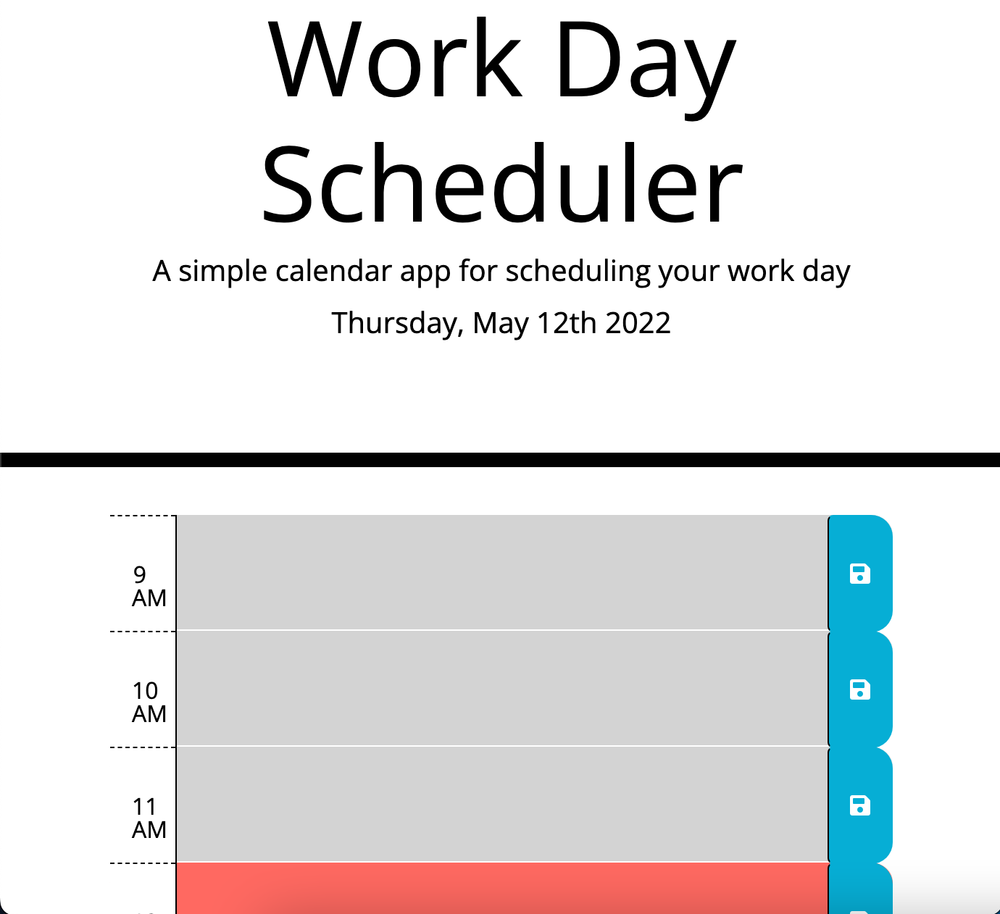

# past-mase
# Third-Party APIs Challenge: Work Day Scheduler

## Description
This work day scheduler allows the user to keep track of their busy work day. The time blocks start at 9am and finish at 5pm. These time blocks are then color coded based off of past, present, and future events based off of the current date at the top. The user inputs data and then is given the option to save using the save button. 

## User Story 
AS AN employee with a busy schedule
I WANT to add important events to a daily planner
SO THAT I can manage my time effectively

## Acceptance Criteria 
GIVEN I am using a daily planner to create a schedule
WHEN I open the planner
THEN the current day is displayed at the top of the calendar
WHEN I scroll down
THEN I am presented with time blocks for standard business hours
WHEN I view the time blocks for that day
THEN each time block is color-coded to indicate whether it is in the past, present, or future
WHEN I click into a time block
THEN I can enter an event
WHEN I click the save button for that time block
THEN the text for that event is saved in local storage
WHEN I refresh the page
THEN the saved events persist

### TODO
-   Fix color coded time block function (DONE)

## Deployed link & screenshot
https://brittanymy.github.io/past-mase/

